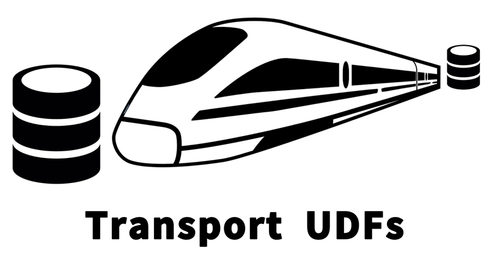

# Transport UDFs

**Transport** is a framework for writing performant user-defined
functions (UDFs) that are portable across a variety of engines
including [Apache Spark](https://spark.apache.org/), [Apache Hive](https://hive.apache.org/), and
[Trino](https://trinodb.io/). Transport UDFs are also
capable of directly processing data stored in serialization formats such as
Apache Avro. With Transport, developers only need to implement their UDF
logic once using the Transport API. Transport then takes care of
translating the UDF to native UDF version targeted at various engines
or formats. Currently, Transport is capable of generating
engine-artifacts for Spark, Hive, and Trino, and format-artifacts for
Avro. Further details on Transport can be found in this [LinkedIn Engineering blog post](https://engineering.linkedin.com/blog/2018/11/using-translatable-portable-UDFs).

## Documentation

- Project information: [README.md](/README.md)
  - Transport release notes: [docs/release-notes.md](/docs/release-notes.md)
  - Contributing: [#contributing](#contributing)
- User guides
  - Transport UDFs API: [docs/transport-udfs-api.md](/docs/transport-udfs-api.md)
  - Authoring Transport UDFs: [docs/authoring-transport-udfs.md](/docs/authoring-transport-udfs.md)
  - Using Transport UDFs: [docs/using-transport-udfs.md](/docs/using-transport-udfs.md)
  - Writing Tests for Transport UDFs: [docs/writing-tests.md](/docs/writing-tests.md)
  - FAQ: [docs/faq.md](/docs/faq.md)
- Developer guides
  - How the Transport Plugin works: [TODO]
  - How the Transport Test Framework works: [TODO]


## Example

This example shows how a portable UDF is written using the Transport APIs.

```java
public class MapFromTwoArraysFunction extends StdUDF2<StdArray, StdArray, StdMap> implements TopLevelStdUDF {

  private StdType _mapType;

  @Override
  public List<String> getInputParameterSignatures() {
    return ImmutableList.of(
        "array(K)",
        "array(V)"
    );
  }

  @Override
  public String getOutputParameterSignature() {
    return "map(K,V)";
  }

  @Override
  public void init(StdFactory stdFactory) {
    super.init(stdFactory);
    _mapType = getStdFactory().createStdType(getOutputParameterSignature());
  }

  @Override
  public StdMap eval(StdArray a1, StdArray a2) {
    if (a1.size() != a2.size()) {
      return null;
    }
    StdMap map = getStdFactory().createMap(_mapType);
    for (int i = 0; i < a1.size(); i++) {
      map.put(a1.get(i), a2.get(i));
    }
    return map;
  }

  @Override
  public String getFunctionName() {
    return "map_from_two_arrays";
  }

  @Override
  public String getFunctionDescription() {
    return "A function to create a map out of two arrays";
  }
}
```

In the example above, `StdMap` and `StdArray` are interfaces that
provide high-level map and array operations to their
objects. Depending on the engine where this UDF is executed, those
interfaces are implemented differently to deal with native data types
used by that engine. `getStdFactory()` is a method used to create
objects that conform to a given data type (such as a map whose keys
are of the type of elements in the first array and values are of the
type of elements in the second array). `StdUDF2` is an abstract class
to express a UDF that takes two parameters. It is parametrized by the
UDF input types and the UDF output type. Please consult the [Transport UDFs API](/docs/transport-udfs-api.md) for more details and examples.

## How to Build
Clone the repository:
```bash
git clone https://github.com/linkedin/transport.git
```
Change directory to `transport`:
```bash
cd transport
```

Build:
```bash
./gradlew build
```

Please note that this project requires Java `1.8.0_151` or higher.
Either set `JAVA_HOME` to the home of an appropriate version and then use `./gradlew build` as described above, or set the `org.gradle.java.home` gradle property to the Java home of an appropriate version as below:
```bash
./gradlew -Dorg.gradle.java.home=/path/to/java/home build
```

## How to Use
The project under the directory [`transportable-udfs-examples`](transportable-udfs-examples) is a standalone Gradle project
that shows how to setup a project that uses the Transport UDFs framework to write Transportable UDFs.
You can model your project after that standalone project. It implements a number of [example
UDFs](transportable-udfs-examples/transportable-udfs-example-udfs) to showcase different features and aspects of the API.
 Basically, you need to check out three components:

* [UDF examples code](transportable-udfs-examples/transportable-udfs-example-udfs/src/main/java/com/linkedin/transport/examples)
to familiarize yourself with the API, and how to write new UDFs. 

* [Test code](transportable-udfs-examples/transportable-udfs-example-udfs/src/test/java/com/linkedin/transport/examples)
 to find out how to write UDF tests in a unified testing API, but have the framework test them on multiple platforms.

* Root [`build.gradle`](transportable-udfs-examples/build.gradle) file
to find out how to apply the `transport` plugin, which enables generating Hive, Spark, and Trino UDFs out of
the transportable UDFs you define once you build your project. To see that in action:

Change directory to `transportable-udfs-examples`:

```bash
cd transportable-udfs-examples
```

Build `transportable-udfs-examples`:

```bash
gradle build
```

You will notice that the build process generates some code. This is the platform-specific versions of the UDFs.
Once the build succeeds, check out the output artifacts: 

```bash
ls transportable-udfs-example-udfs/build/libs/
```

The results should be like:

```
transportable-udfs-example-udfs-hive.jar
transportable-udfs-example-udfs-trino.jar
transportable-udfs-example-udfs-spark.jar
transportable-udfs-example-udfs.jar
```

That is it! While only one version of the UDFs is implemented, multiple jars are produced upon building the project.
Each of those jars uses native platform APIs and data models to implement the UDFs. So from an execution engine's perspective,
there is no data transformation needed for interoperability or portability. Only suitable classes are used for each engine.

To call those jars from your SQL engine (i.e., Hive, Spark, or Trino), the standard process for deploying UDF jars is followed
for each engine. For example, in Hive, you add the jar to the classpath using the `ADD JAR` statement,
 and register the UDF using `CREATE FUNCTION` statement.
In Trino, the jar is deployed to the `plugin` directory. However, a small patch is required for the Trino
engine to recognize the jar as a plugin, since the generated Trino UDFs implement the `SqlScalarFunction` API,
which is currently not part of Trino's SPI architecture. You can find the patch [here](docs/transport-udfs-trino.patch) and apply it
 before deploying your UDFs jar to the Trino engine.
 
## Contributing
The project is under active development and we welcome contributions of different forms:

* Contributing new general-purpose Transport UDFs (e.g., Machine Learning UDFs, Spatial UDFs, Linear Algebra UDFs, etc).

* Contributing new platform support.

* Contributing a framework for new types of UDFs, e.g., aggregate UDFs (UDAFs), or table functions (UDTFs).

Please take a look at the [Contribution Agreement](CONTRIBUTING.md).

## Questions?
Please send any questions or discussion topics to [transport-udfs@googlegroups.com](mailto:transport-udfs@googlegroups.com)

## License

    BSD 2-CLAUSE LICENSE

    Copyright 2018 LinkedIn Corporation.
    All Rights Reserved.
    Redistribution and use in source and binary forms, with or without
    modification, are permitted provided that the following conditions are
    met:

    1. Redistributions of source code must retain the above copyright
       notice, this list of conditions and the following disclaimer.

    2. Redistributions in binary form must reproduce the above copyright
       notice, this list of conditions and the following disclaimer in the
       documentation and/or other materials provided with the
       distribution.

    THIS SOFTWARE IS PROVIDED BY THE COPYRIGHT HOLDERS AND CONTRIBUTORS
    "AS IS" AND ANY EXPRESS OR IMPLIED WARRANTIES, INCLUDING, BUT NOT
    LIMITED TO, THE IMPLIED WARRANTIES OF MERCHANTABILITY AND FITNESS FOR
    A PARTICULAR PURPOSE ARE DISCLAIMED. IN NO EVENT SHALL THE COPYRIGHT
    HOLDER OR CONTRIBUTORS BE LIABLE FOR ANY DIRECT, INDIRECT, INCIDENTAL,
    SPECIAL, EXEMPLARY, OR CONSEQUENTIAL DAMAGES (INCLUDING, BUT NOT
    LIMITED TO, PROCUREMENT OF SUBSTITUTE GOODS OR SERVICES; LOSS OF USE,
    DATA, OR PROFITS; OR BUSINESS INTERRUPTION) HOWEVER CAUSED AND ON ANY
    THEORY OF LIABILITY, WHETHER IN CONTRACT, STRICT LIABILITY, OR TORT
    (INCLUDING NEGLIGENCE OR OTHERWISE) ARISING IN ANY WAY OUT OF THE USE
    OF THIS SOFTWARE, EVEN IF ADVISED OF THE POSSIBILITY OF SUCH DAMAGE.
